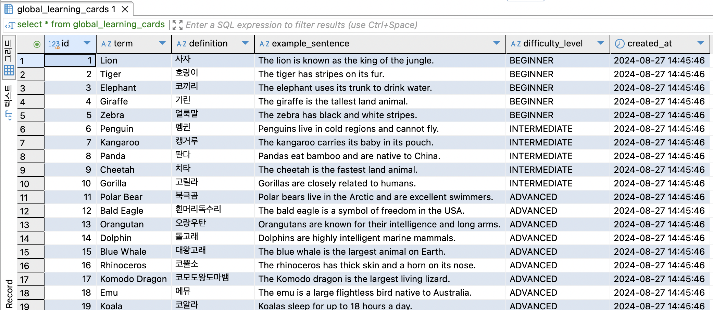

# Leitner 시스템을 이용한 반복 학습 프로그램

## 개요

토리에듀핀 마루랩 학습 컨텐츠에 들어갈, 반복 학습 로직 구현을 위한 사이드 프로젝트

## 구현 후기

- 작은 프로젝트를 구현해보며 추가해야 할 기능 로직을 점검할 수 있었습니다
- 작은 규모, 빠른 구현을 위해 tailwindCSS 등 파일을 분리하지 않고 사용하는 방법을 연습했습니다
- ui와 hook을 분리하고 컴포넌트로 조립해나갈 때, 코드 구조가 단순해지는 것을 확인했습니다
- 반면, 잘개 쪼개진 컴포넌트 단위가 어떤 목적과 용도를 가지고 있는 지 공유를 위한 명세, 협의가 필요함을 알게되었습니다
- access-token, refresh-token 등 토큰을 이용해 사용자를 점검하고, 사용자 정보를 꺼내어 활용할 수 있었습니다

## 프로젝트 목표

### Frontend

- Nextjs 13(page router) 방식의 사용법 익히기
- ui, component, hook, page을 구분해보며, 개발의 기준 단위 만들기
- tailwindCSS 사용법 익히기
- 클린 코드 작성하기

### Backend

- 리트너 알고리즘을 적용한 반복 학습 알고리즘 구현하기
- JWT Token을 사용한 유저 로그인 관리하기

## Leitner 시스템이란?

독일의 과학 저널리스트 Leitner가 제안한 플래시카드를 효율적으로 학습하는 방법
정답을 맞힌 경우, 다음 번호의 박스에 카드를 담는다
정답을 틀린 경우, 이전 번호의 박스에 카드를 담는다
박스 번호가 클 수록 반복 기간을 늘려 장기 기억 학습이 이뤄지도록 한다

## 구현 상세

### 로그인

- 패스워드가 DB에 노출되지 않도록 encode를 진행했습니다
- role, level을 두어 기능을 확장할 수 있습니다
- 생성 시점과 업데이트 시점을 기록합니다
- 데이터 타입의 유효성 검사를 진행합니다

### 카드 학습

- 제시된 학습 카드에 대해 기억 여부를 스스로 체크합니다
- 기억여부를 체크하면 정답 내용을 보여주고 다음 문제로 넘어갈 수 있도록 합니다
- 제시된 카드를 알고 있음 표시를 한 경우 다음 박스로 이동시킵니다
- 제시된 카드를 모르고 있음 표시를 한 경우 이전 박스로 이동시킵니다

#### 예시 1

#### 예시 2

#### 박스

- 박스별 복습 주기를 테이블로 관리해서 수정 가능합니다
- 카드는 반복 주기 이후에 사용자 학습 과정에서 조회될 수 있도록 합니다
- 5번 박스까지 이동한 경우 암기한 것으로 평가하고 복습 주기를 임의의 큰 숫자로 입력했습니다

#### 박스 대시보드

- 사용자의 학습 현황 데이터를 확인합니다

#### 전체 학습 데이터

- 전체 사용자를 위한 학습 DB를 관리합니다

## Swagger

